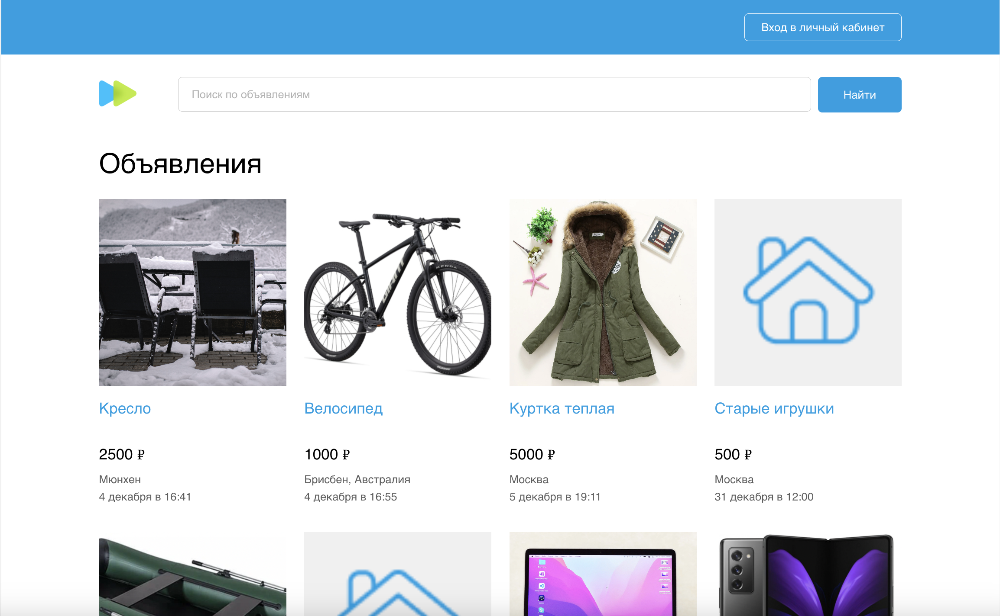
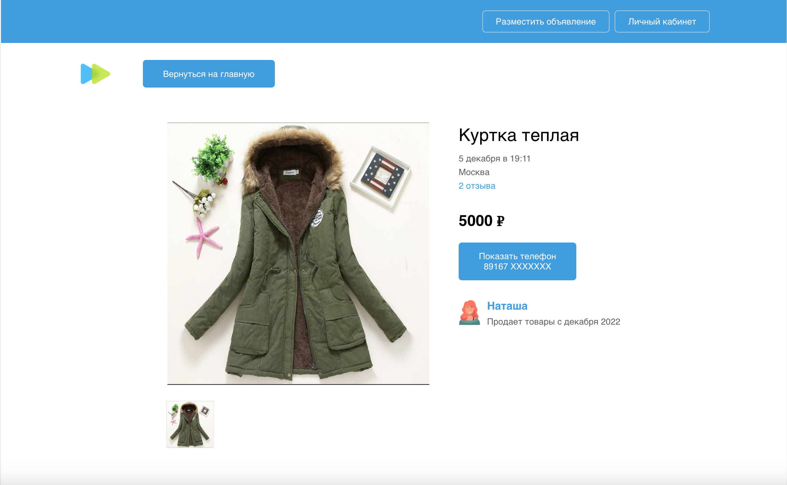
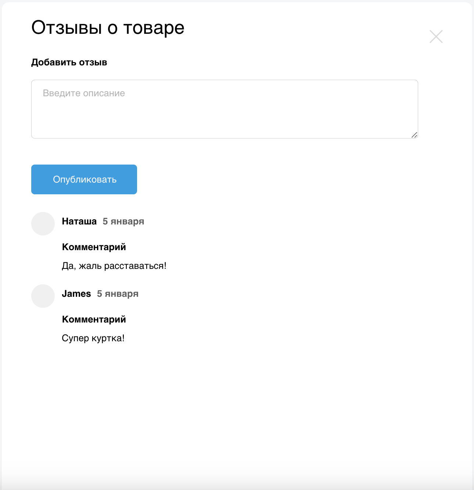
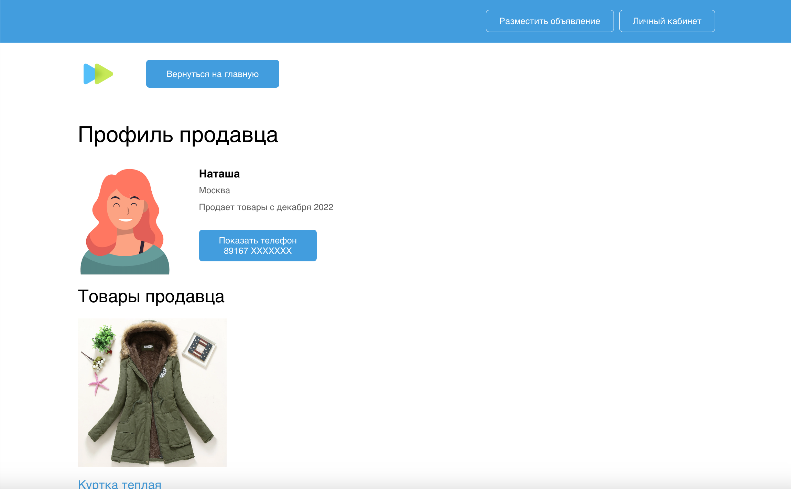
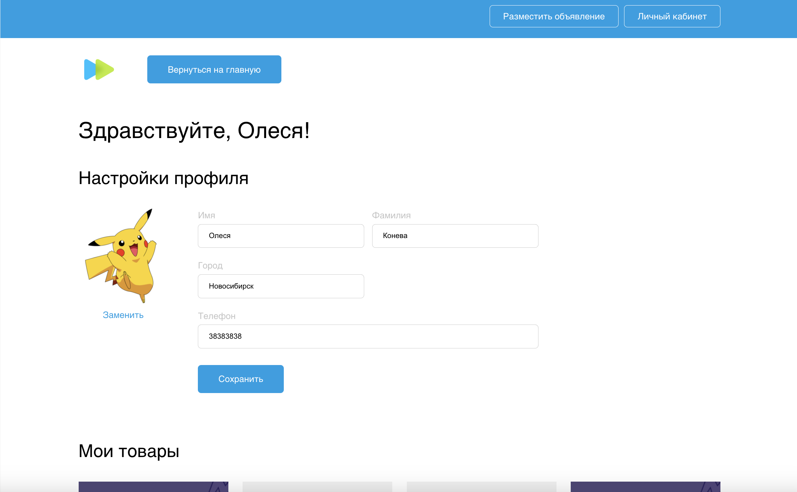
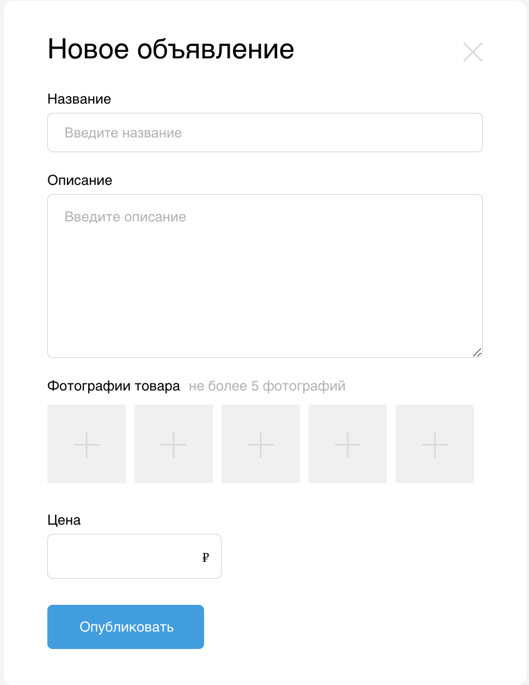
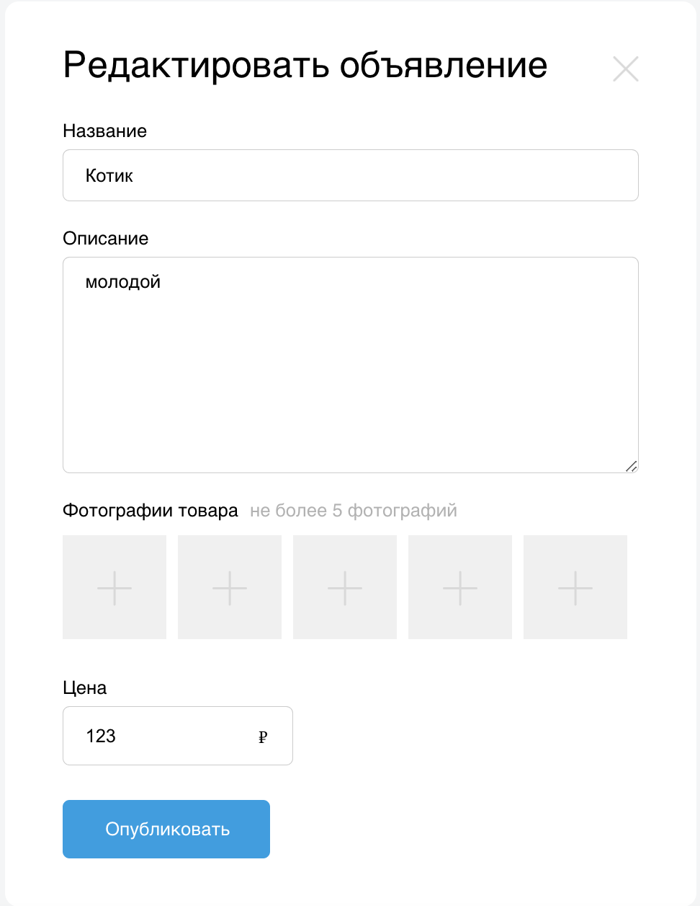

# Финальный проект по курсу Web-разработчик Skypro

## Описание проекта
skypro-avito - это платформа для продажи и покупки товаров и услуг, аналог Avito.

В проекте используются: JavaScript, React, RTK Query, Redux Toolkit, Styled components и Docker.

Основные функции: 
- Регистрация и авторизация пользователей
- Редактирование профиля пользователя
- Добавление и изменение аватара пользователя
- Создание объявлений о продаже с загрузкой изображений и без
- Редактирование объявлений о продаже
- Снятие объявлений с публикации
- Поиск товаров по названию
- Просмотр профиля продавца
- Просмотр комментариев к товару
- Возможность оставлять комментарии к товарам
- Десктопная и мобильная версии

&nbsp;
&nbsp;
&nbsp;
&nbsp;
&nbsp;
&nbsp;
&nbsp;

## Техническое описание
Для того, чтобы посмотреть проект, необходимо:  
1. Скачать файл backend'a по [ссылке](https://drive.google.com/file/d/1pFE-NRANTsWmQwTyURjHXuECMmoKCFjO/view) и развернуть его в Docker.
   - Скачайте и разархивируйте архив
   - Через терминал перейдите в разархивированную папку
   - В терминале запустите команду: `docker-compose -f docker-compose-backend.yaml up -d`
3. Установить зависимости командой `npm install`
4. Запустить проект командой `npm run start`

`src/` — директория, содержащая исходный код проекта.

Над проектом работала Олеся Конева  